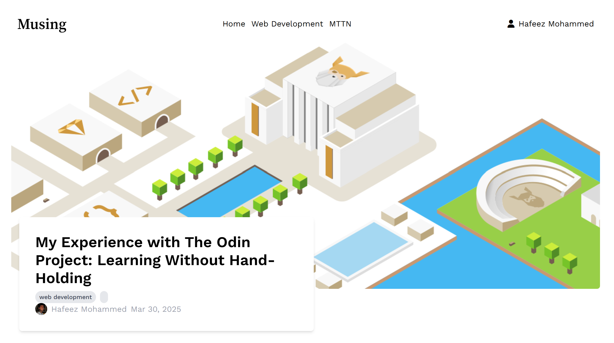
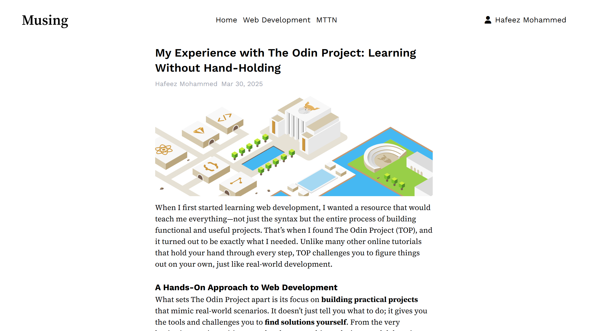
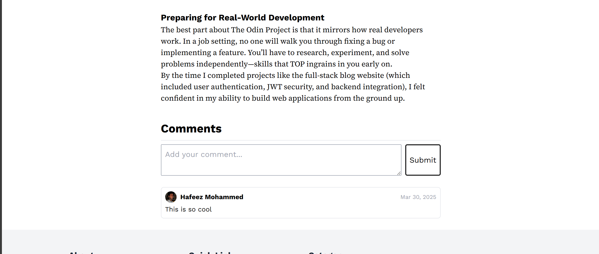
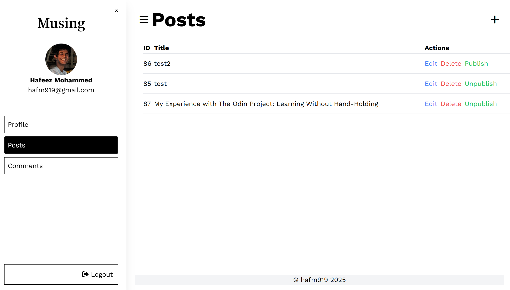
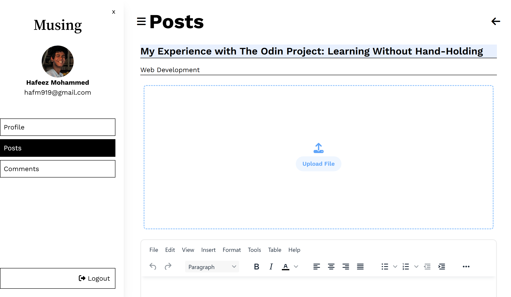

# Musing

A full-stack blog application built as part of **The Odin Project**, featuring a **React and Tailwind CSS** frontend with a **Node.js, Express, and Prisma** backend.

## 🚀 Features

### Backend

- **Express & Prisma** for database management
- **JWT authentication** for user accounts and route protection
- **RESTful API** with routes for posts, comments, and users
- **Role-based access control** (Admins can manage posts and comments)
- **Published vs. unpublished posts** toggle functionality
- **Timestamps for posts and comments**

### Frontend

- **React-based UI** with Tailwind CSS for styling
- **Admin dashboard** to manage posts and comments
- **Markdown-based rich text editor** for writing posts
- **Authentication system** (login/logout with JWT storage in localStorage)
- **Commenting system** with optional username/email

## 🛠️ Tech Stack

- **Frontend**: React, Tailwind CSS
- **Backend**: Node.js, Express, Prisma, PostgreSQL
- **Authentication**: JSON Web Tokens (JWT)

## Screenshots

## 📌 To-Do

- [ ] Implement comment moderation features
- [ ] Improve SEO & performance optimizations
- [ ] Add rich text editor for writing posts

## 🤝 Contributing

Feel free to fork and contribute by submitting a PR!

## 📜 License

This project is licensed under the MIT License.

---

Built with ❤️ for **The Odin Project**!
